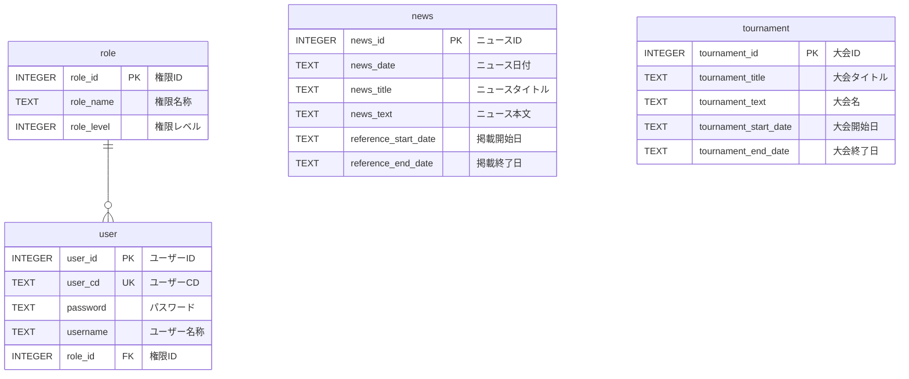
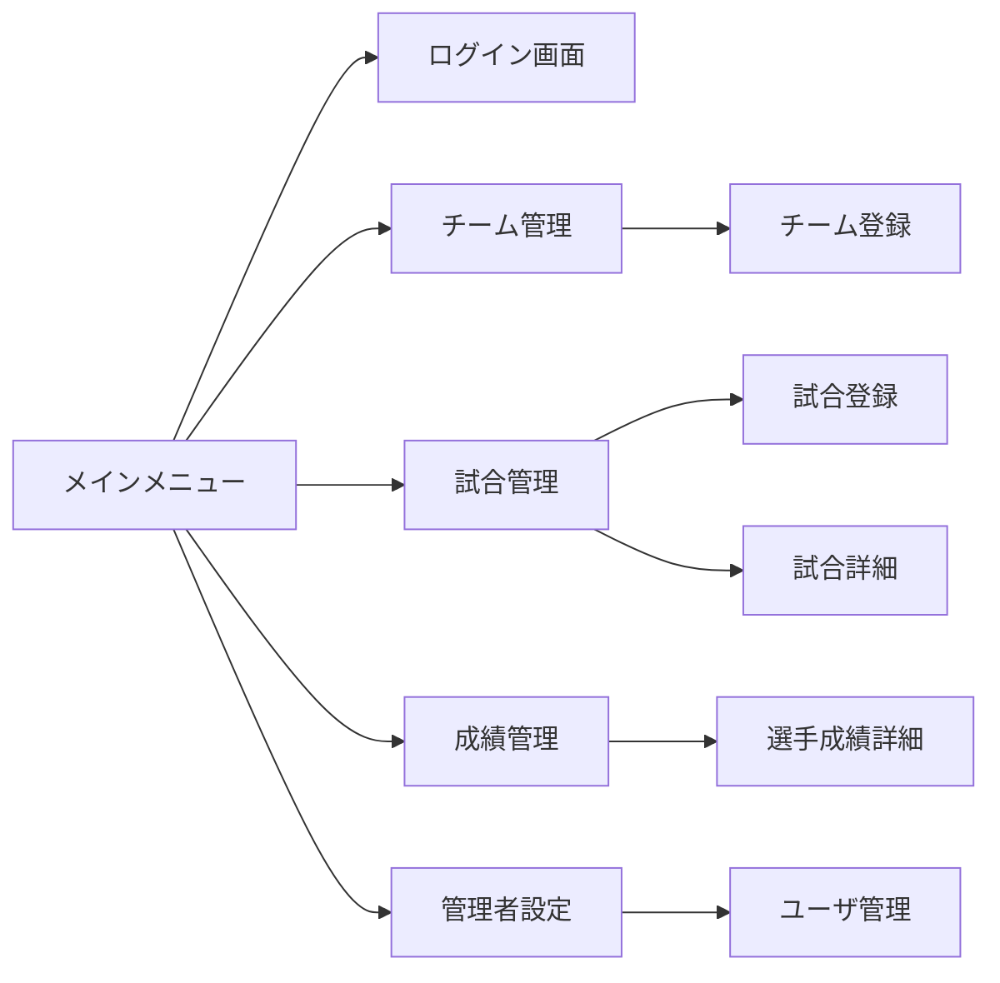

<link rel="stylesheet" href="markdown-style.css">

# 野球大会管理システム

## 目次 <!-- omit in toc -->

1. [1. 基本設計書](#1-基本設計書)
	1. [1.1. システム構成](#11-システム構成)
	2. [1.2. データベース設計](#12-データベース設計)
		1. [本番環境](#本番環境)
		2. [開発環境](#開発環境)
			1. [データベース作成](#データベース作成)
		3. [1.2.1. ER図](#121-er図)
		4. [1.2.2. baseball\_information ( お知らせテーブル )](#122-baseball_information--お知らせテーブル-)
		5. [1.2.3. baseball\_role ( 権限テーブル )](#123-baseball_role--権限テーブル-)
		6. [1.2.4. baseball\_tournament ( 大会テーブル )](#124-baseball_tournament--大会テーブル-)
		7. [1.2.5. baseball\_user ( ユーザーテーブル )](#125-baseball_user--ユーザーテーブル-)
		8. [1.2.6. 運用ログ（Log/ 配下のファイル出力）](#126-運用ログlog-配下のファイル出力)
		9. [1.2.7. teams](#127-teams)
		10. [1.2.8. players](#128-players)
		11. [1.2.9. games](#129-games)
		12. [1.2.10. game\_scores](#1210-game_scores)
		13. [1.2.11. player\_stats](#1211-player_stats)
		14. [1.2.12. batteries](#1212-batteries)
		15. [1.2.13. starting\_members](#1213-starting_members)
		16. [1.2.14. reserve\_members](#1214-reserve_members)
	3. [1.3. 2-4. 画面設計（概要）](#13-2-4-画面設計概要)
	4. [1.4. 2-5. 処理フロー例](#14-2-5-処理フロー例)
		1. [1.4.1. 2-5-1. ログイン処理](#141-2-5-1-ログイン処理)
	5. [1.5. 組み合わせ表インポート](#15-組み合わせ表インポート)
	6. [1.6. 試合結果入力・裏トーナメント転記](#16-試合結果入力裏トーナメント転記)
	7. [1.7. 準々決勝以降のアクセス制限](#17-準々決勝以降のアクセス制限)
2. [2. 画面設計・UI/UX](#2-画面設計uiux)
	1. [2.1. 3-1. 画面遷移図（例）](#21-3-1-画面遷移図例)
	2. [2.2. 1-1. 画面遷移図（サンプル）](#22-1-1-画面遷移図サンプル)
	3. [2.3. 3-2. ワイヤーフレーム例（テキスト）](#23-3-2-ワイヤーフレーム例テキスト)
	4. [2.4. 3-3. バリデーション仕様](#24-3-3-バリデーション仕様)
3. [3. 権限・操作仕様](#3-権限操作仕様)
	1. [3.1. 4-1. 権限ごとの操作一覧](#31-4-1-権限ごとの操作一覧)
	2. [3.2. 4-2. 操作ログ仕様](#32-4-2-操作ログ仕様)
4. [4. セキュリティ・運用](#4-セキュリティ運用)
	1. [4.1. 5-1. アカウントロック仕様](#41-5-1-アカウントロック仕様)
	2. [4.2. 5-2. パスワードリセット](#42-5-2-パスワードリセット)
	3. [4.3. 5-3. データバックアップ・リストア](#43-5-3-データバックアップリストア)
5. [5. テスト設計](#5-テスト設計)
	1. [5.1. 6-1. テストケース](#51-6-1-テストケース)
	2. [5.2. 6-2. テストデータ仕様](#52-6-2-テストデータ仕様)
6. [6. 拡張性・保守性](#6-拡張性保守性)
	1. [6.1. 7-1. CSVインポート/エクスポート仕様](#61-7-1-csvインポートエクスポート仕様)
	2. [6.2. 7-2. 設定ファイル仕様](#62-7-2-設定ファイル仕様)
	3. [6.3. 7-3. FAQ・運用マニュアル](#63-7-3-faq運用マニュアル)
7. [7. 追加機能設計](#7-追加機能設計)
	1. [7.1. 8-1. ランキング集計](#71-8-1-ランキング集計)
	2. [7.2. 8-2. 通知機能](#72-8-2-通知機能)
	3. [7.3. 8-3. API設計（詳細はAPI仕様書参照）](#73-8-3-api設計詳細はapi仕様書参照)
8. [8. API仕様書](#8-api仕様書)
	1. [8.1. 9-1. 共通仕様](#81-9-1-共通仕様)
	2. [8.2. 9-2. エンドポイント一覧](#82-9-2-エンドポイント一覧)
	3. [8.3. 9-3. エンドポイント詳細](#83-9-3-エンドポイント詳細)
		1. [8.3.1. 9-3-1. チーム一覧取得](#831-9-3-1-チーム一覧取得)
		2. [8.3.2. 9-3-2. チーム新規登録](#832-9-3-2-チーム新規登録)
		3. [8.3.3. 9-3-3. 選手一覧取得（チーム指定）](#833-9-3-3-選手一覧取得チーム指定)
		4. [8.3.4. 9-3-4. 試合新規登録](#834-9-3-4-試合新規登録)
		5. [8.3.5. 9-3-5. 試合スコア登録](#835-9-3-5-試合スコア登録)
		6. [8.3.6. 9-3-6. 成績登録](#836-9-3-6-成績登録)
		7. [8.3.7. 9-3-7. 通知一覧取得](#837-9-3-7-通知一覧取得)
		8. [8.3.8. 9-3-8. ログイン](#838-9-3-8-ログイン)
	4. [8.4. 9-4. エラー応答](#84-9-4-エラー応答)
	5. [8.5. 9-5. 認証フロー](#85-9-5-認証フロー)
9. [9. 認証フロー全体図](#9-認証フロー全体図)
10. [10. 詳細フロー](#10-詳細フロー)
	 1. [10.1. 2-1. ログイン](#101-2-1-ログイン)
	 2. [10.2. 2-2. APIリクエスト時の認証](#102-2-2-apiリクエスト時の認証)
	 3. [10.3. 2-3. ログアウト](#103-2-3-ログアウト)
11. [11. セキュリティ上の注意点](#11-セキュリティ上の注意点)
12. [12. 認証フロー図（テキスト）](#12-認証フロー図テキスト)
13. [13. 補足](#13-補足)
	 1. [13.1. 要件定義書](#131-要件定義書)
	 2. [13.2. 機能要件](#132-機能要件)
	 3. [13.3. データベース設計](#133-データベース設計)
	 4. [13.4. 画面設計・UI/UX](#134-画面設計uiux)
	 5. [13.5. 権限・運用設計](#135-権限運用設計)
	 6. [13.6. 処理フロー](#136-処理フロー)
	 7. [13.7. 課題・運用ルール](#137-課題運用ルール)


---


## 1. 基本設計書

> 本書は現行ソースコードと DB 定義を正本として扱い、実装済みのテーブル・処理・画面構成を中心に整理した内容である。現行実装に存在しないテーブルや試作ロジックは、将来拡張または補足として扱う。

### 1.1. システム構成

- バックエンド：PHP 8.x
- 設定DB：SQLite（`config` / `menu` 等）
- 業務DB：MySQL（`baseball_*` 系テーブル）
- フロントエンド：HTML, CSS, JavaScript
- セッション管理：PHP 標準セッション
- メール送信：PHPMailer
- ログ出力：`Log/` 配下のファイル
- 追加機能の扱い：CSV/Excel などのインポートや高度なトーナメント計算は、将来拡張として想定されるが、現行実装の対象外とする

### 1.2. データベース設計

#### 本番環境
- SQLite3( 設定DB )
  |ホスト名|データベース名|ユーザ名|パスワード|備考|
  |:--|:--|:--|:--|:--|
  |baseball_production.db|-|-|-|SQLite3/3.7.17|

- MySQL( データDB )
  |ホスト名|データベース名|ユーザ名|パスワード|備考|
  |:--|:--|:--|:--|:--|
  |mysql312.phy.lolipop.lan|LAA0938815-hpl|LAA0938815|Guinsaga098|Lolipop/8.0|

#### 開発環境
- SQLite3( 設定DB )
  |ホスト名|データベース名|ユーザ名|パスワード|備考|
  |:--|:--|:--|:--|:--|
  |baseball_develop.db|-|-|-|WSL/Ubuntsu/SQLite3/3.45.1|

- MySQL( データDB )
  |ホスト名|データベース名|ユーザ名|パスワード|備考|
  |:--|:--|:--|:--|:--|
  |127.0.0.1|LAA0938815-hpl|LAA0938815|Guinsaga-098|WSL/Ubuntsu/8.0.44|

##### データベース作成
```mysql
mysql> CREATE DATABASE `LAA0938815-hpl`;
Query OK, 1 row affected (0.81 sec)

mysql> SHOW DATABASES;
+--------------------+
| Database           |
+--------------------+
| LAA0938815-hpl     |
| information_schema |
| mysql              |
| performance_schema |
| sys                |
+--------------------+
5 rows in set (1.26 sec)

mysql> CREATE USER 'LAA0938815'@'%' IDENTIFIED BY 'Guinsaga-098';
mysql> GRANT ALL PRIVILEGES ON *.* TO 'LAA0938815'@'%' WITH GRANT OPTION;
mysql> FLUSH PRIVILEGES;

mysql> GRANT ALL PRIVILEGES ON `LAA0938815-hpl`.* TO 'LAA0938815'@'%' WITH GRANT OPTION;
mysql> FLUSH PRIVILEGES;
```

#### 1.2.1. ER図



#### 1.2.2. baseball_information ( お知らせテーブル )

| カラム名 | 項目名 | 型  | 長さ | キー | 必須 | 初期値 | 説明 |
| :------ | :----- | :-- | --: | :--: | :--: | :---  | :-- |
| information_id       | 通知ID       | INT    | 4       | PK | 〇 | AUTO_INCREMENT | 一意のID |
| title                | 通知タイトル | VARCHAR | 255     | -  | 〇 | - | ニュースのタイトル |
| content              | 通知内容     | TEXT    | 65,535 | -  | 〇 | - | ニュースの本文 |
| post_date            | 投稿日       | DATE    | 3      | -  | 〇 | - | ニュースの投稿日 |
| reference_start_date | 掲載開始日   | DATE    | 3      | -  | -  | - | ニュースを掲載開始する日付 |
| reference_end_date   | 掲載終了日   | DATE    | 3      | -  | -  | - | ニュースを掲載終了する日付 |
| is_enabled | 有効フラグ | INT      | 4   | - | 〇 | 0 | レコードの有効性( 0: 無効, 1: 有効 ) |
| created_at | 作成日時   | DATETIME | 8   | - | 〇 | CURRENT_TIMESTAMP | データを作成した日時 |
| created_by | 作成者     | VARCHAR  | 255 | - | -  | - | データを作成したユーザー(プログラム) |
| updated_at | 更新日時   | DATETIME | 8   | - | 〇 | CURRENT_TIMESTAMP ON UPDATE CURRENT_TIMESTAMP | データを更新した日時 |
| updated_by | 更新者     | VARCHAR  | 255 | - | -  | - | データを更新したユーザー(プログラム) |

#### 1.2.3. baseball_role ( 権限テーブル )

| カラム名 | 項目名 | 型  | 長さ | キー | 必須 | 初期値 | 説明 |
| :------ | :----- | :-- | --: | :--: | :--: | :---  | :-- |
| role_id | 権限ID | INT | 4 | PK | 〇 | AUTO_INCREMENT | 一意のID |
| role_name | 権限名称 | VARCHAR | 255 | - | 〇 | - | 権限の名称 |
| role_level | 権限レベル | INT | 4 | UK | 〇 | - | 0: 一般, 1: 登録済み, 10: 監督, 100: 本部, 1000: システム管理者 |
| is_enabled | 有効フラグ | INT      | 4   | - | 〇 | 0 | レコードの有効性( 0: 無効, 1: 有効 ) |
| created_at | 作成日時   | DATETIME | 8   | - | 〇 | CURRENT_TIMESTAMP | データを作成した日時 |
| created_by | 作成者     | VARCHAR  | 255 | - | -  | - | データを作成したユーザー(プログラム) |
| updated_at | 更新日時   | DATETIME | 8   | - | 〇 | CURRENT_TIMESTAMP ON UPDATE CURRENT_TIMESTAMP | データを更新した日時 |
| updated_by | 更新者     | VARCHAR  | 255 | - | -  | - | データを更新したユーザー(プログラム) |

#### 1.2.4. baseball_tournament ( 大会テーブル )

| カラム名 | 項目名 | 型  | 長さ | キー | 必須 | 初期値 | 説明 |
| :------ | :----- | :-- | --: | :--: | :--: | :---  | :-- |
| tournament_id | 大会ID | INT | 4 | PK | 〇 | AUTO_INCREMENT | 一意のID |
| tournament_title | 大会タイトル | VARCHAR | 255 | - | 〇 | - | 第○回などのタイトル |
| tournament_text | 大会名 | VARCHAR | 255 | - | 〇 | - | ○○大会などの名称 |
| tournament_start_date | 大会開始日 | DATE | 3 | - | 〇 | - | 開催開始日 |
| tournament_end_date | 大会終了日 | DATE | 3 | - | 〇 | - | 終了日 |
| tournament_parent_id | 親大会ID | INT | 4 | - | - | 0 | 連携する親大会のID |
| tournament1_teams | 1部参加チーム数 | INT | 4 | - | 〇 | 0 | 1回戦等の参加数 |
| tournament1_text | 1部説明 | VARCHAR | 255 | - | - | '' | 1部の説明文 |
| tournament2_teams | 2部参加チーム数 | INT | 4 | - | 〇 | 0 | 2部の参加数 |
| tournament2_text | 2部説明 | VARCHAR | 255 | - | - | '' | 2部の説明文 |
| tournament3_teams | 3部参加チーム数 | INT | 4 | - | 〇 | 0 | 3部の参加数 |
| tournament3_text | 3部説明 | VARCHAR | 255 | - | - | '' | 3部の説明文 |
| tournament_attachment_id | 添付ファイルID | INT | 4 | - | - | 0 | ルール/申込書等の添付データID |
| is_enabled | 有効フラグ | INT | 4 | - | 〇 | 0 | レコードの有効性( 0: 無効, 1: 有効 ) |
| created_at | 作成日時 | DATETIME | 8 | - | 〇 | CURRENT_TIMESTAMP | 作成日時 |
| created_by | 作成者 | VARCHAR | 255 | - | - | - | 作成したユーザー(プログラム) |
| updated_at | 更新日時 | DATETIME | 8 | - | 〇 | CURRENT_TIMESTAMP ON UPDATE CURRENT_TIMESTAMP | 更新日時 |
| updated_by | 更新者 | VARCHAR | 255 | - | - | - | 更新したユーザー(プログラム) |

#### 1.2.5. baseball_user ( ユーザーテーブル )

| カラム名 | 項目名 | 型  | 長さ | キー | 必須 | 初期値 | 説明 |
| :------ | :----- | :-- | --: | :--: | :--: | :---  | :-- |
| user_id | ユーザーID | INT | 4 | PK | 〇 | AUTO_INCREMENT | 一意のID |
| user_cd | ユーザーCD | VARCHAR | 255 | UK | 〇 | - | サインインに利用するコード |
| password | パスワード | VARCHAR | 255 | - | 〇 | - | パスワード（ハッシュ化） |
| username | ユーザー名称 | VARCHAR | 255 | - | 〇 | - | ユーザーの表示名称 |
| email | メールアドレス | VARCHAR | 255 | - | 〇 | - | 認証コード送信先 |
| role_level | 権限レベル | INT | 4 | - | 〇 | 0 | 0: 一般, 1: 登録済み, 10: 監督, 100: 本部, 1000: システム管理者 |
| verification_cd | 認証コード | VARCHAR | 255 | - | 〇 | '' | 認証コード |
| verification_period | 認証有効期限 | INT | 4 | - | 〇 | 0 | 認証コードの有効期限 |
| signin_at | サインイン日時 | DATETIME | 8 | - | - | - | 最終サインイン日時 |
| signin_by | サインイン者 | VARCHAR | 255 | - | - | - | サインインしたユーザー(プログラム) |
| is_enabled | 有効フラグ | INT | 4 | - | 〇 | 0 | レコードの有効性( 0: 無効, 1: 有効 ) |
| created_at | 作成日時 | DATETIME | 8 | - | 〇 | CURRENT_TIMESTAMP | データを作成した日時 |
| created_by | 作成者 | VARCHAR | 255 | - | - | - | データを作成したユーザー(プログラム) |
| updated_at | 更新日時 | DATETIME | 8 | - | 〇 | CURRENT_TIMESTAMP ON UPDATE CURRENT_TIMESTAMP | データを更新した日時 |
| updated_by | 更新者 | VARCHAR | 255 | - | - | - | データを更新したユーザー(プログラム) |

#### 1.2.6. 運用ログ（Log/ 配下のファイル出力）

現行実装では、`user_logs` のような専用DBテーブルは定義されていない。ログは `Log/` 配下にファイル出力され、`Class_Log.php` から `notice`, `warning`, `error`, `debug` が利用される。

| 項目 | 内容 |
| :--- | :--- |
| 出力先 | `Log/baseball.log` など |
| ログレベル | 0,1,2,4,8 の段階 |
| 主な利用 | 認証失敗、入力異常、DB接続エラー、処理トレース |
| 実装方式 | `Class_Log` による標準出力＋ファイル書き込み |

> `user_logs` については、設計書上の補足としては運用ログ想定のモデルであり、現行SQL定義の中では実装されていない。

#### 1.2.7. teams

| カラム名  | 型                  | 説明     |
| :-------- | :------------------ | :------- |
| team_id   | INTEGER PRIMARY KEY | チームID |
| team_name | TEXT                | チーム名 |
| entry_number     | INTEGER             | エントリーナンバー |

> 以下の `teams` / `players` / `games` / `game_scores` / `player_stats` 系は、設計書上の概念モデルとして記載されている。一方、現行のインストール SQL では `baseball_team`, `baseball_game`, `baseball_tournament`, `baseball_user`, `baseball_information` が実体として定義されているため、実装記述は現行定義を優先する。

#### 1.2.8. players

| カラム名    | 型                  | 説明         |
| :---------- | :------------------ | :----------- |
| player_id   | INTEGER PRIMARY KEY | 選手ID       |
| team_id     | INTEGER             | 所属チームID |
| player_name | TEXT                | 選手名       |
| position    | TEXT                | ポジション   |
| uniform_number | INTEGER           | 背番号       |

#### 1.2.9. games
| カラム名  | 型                  | 説明                     |
| --------- | ------------------- | ------------------------ |
| game_id   | INTEGER PRIMARY KEY | 試合ID                   |
| game_date | TEXT                | 試合日（YYYY-MM-DD）     |
| location  | TEXT                | 試合場所                 |
| team1_id  | INTEGER             | 先攻チームID（外部キー） |
| team2_id  | INTEGER             | 後攻チームID（外部キー） |
| draw_lot_number  | INTEGER             | 抽選番号（試合番号）         |
| tournament_type  | TEXT                | トーナメント種別（表/裏）    |
| block_type       | TEXT                | 山区分（大やま/小やま）      |
| status           | TEXT                | 試合ステータス（自主対戦/本部管理） |


#### 1.2.10. game_scores
| カラム名    | 型                  | 説明               |
| ----------- | ------------------- | ------------------ |
| score_id    | INTEGER PRIMARY KEY | スコアID           |
| game_id     | INTEGER             | 試合ID（外部キー） |
| team1_score | INTEGER             | 先攻チーム得点     |
| team2_score | INTEGER             | 後攻チーム得点     |
| is_draw     | INTEGER             | 引き分けフラグ（0:通常, 1:引き分け, 2:不戦勝等） |
| winner_team_id | INTEGER           | 勝者チームID（抽選勝敗対応） |


#### 1.2.11. player_stats
| カラム名           | 型                  | 説明                                                                                                         |
| ------------------ | ------------------- | ------------------------------------------------------------------------------------------------------------ |
| id                 | INTEGER PRIMARY KEY | 成績ID                                                                                                       |
| player_id          | INTEGER             | 選手ID（外部キー）                                                                                           |
| game_id            | INTEGER             | 試合ID（外部キー）                                                                                           |
| hits               | INTEGER             | ヒット数                                                                                                     |
| runs               | INTEGER             | 得点数                                                                                                       |
| errors             | INTEGER             | エラー数                                                                                                     |
| at_bats            | INTEGER             | 打者：打数                                                                                                   |
| rbis               | INTEGER             | 打者：打点                                                                                                   |
| pitches            | INTEGER             | 打者：被投球数                                                                                               |
| avg                | REAL                | 打者：通算率                                                                                                 |
| home_runs          | INTEGER             | 打者：本塁打                                                                                                 |
| strikeouts         | INTEGER             | 打者：三振                                                                                                   |
| walks              | INTEGER             | 打者：四球                                                                                                   |
| hbp                | INTEGER             | 打者：死球                                                                                                   |
| steals             | INTEGER             | 打者：盗塁                                                                                                   |
| lob                | INTEGER             | 打者：残塁                                                                                                   |
| fielding_errors    | INTEGER             | 打者：失策                                                                                                   |
| putouts            | INTEGER             | 打者：刺殺                                                                                                   |
| assists            | INTEGER             | 打者：補殺                                                                                                   |
| inning_1           | INTEGER             | 打者：1回                                                                                                    |
| inning_2           | INTEGER             | 打者：2回                                                                                                    |
| inning_3           | INTEGER             | 打者：3回                                                                                                    |
| inning_4           | INTEGER             | 打者：4回                                                                                                    |
| inning_5           | INTEGER             | 打者：5回                                                                                                    |
| inning_6           | INTEGER             | 打者：6回                                                                                                    |
| inning_7           | INTEGER             | 打者：7回                                                                                                    |
| inning_8           | INTEGER             | 打者：8回                                                                                                    |
| inning_9           | INTEGER             | 打者：9回                                                                                                    |
| era                | REAL                | 投手：防御率ERA (Earned Run Average)自責点を基にした平均失点率（9回換算） (自責点 / 投球回数)*9              |
| innings_pitched    | INTEGER             | 投手：投球回数 IP (Innings Pitched)何回投げたか（例：6回2/3なら6.2と表記）                                   |
| hits_allowed       | INTEGER             | 投手：被安打 H (Hits)打たれたヒットの数                                                                      |
| home_runs_allowed  | INTEGER             | 投手：被本塁打 HR (Home Runs)打たれたホームランの数                                                          |
| walks_allowed      | INTEGER             | 投手：与四球BB (Base on Balls / Walks)四球（フォアボール）の数                                               |
| hit_by_pitch       | INTEGER             | 投手：与死球HBP (Hit By Pitch)死球の数                                                                       |
| strikeouts_pitched | INTEGER             | 投手：奪三振K (Strikeouts)三振を取った数                                                                     |
| runs_allowed       | INTEGER             | 投手：失点R (Runs)相手に取られた点数（自責点含む）                                                           |
| earned_runs        | INTEGER             | 投手：自責点ER (Earned Runs)投手の責任による失点                                                             |
| wl                 | INTEGER             | 勝敗 W(1) / L(0) (Win / Loss)勝ち投手・負け投手の記録                                                        |
| batters_faced      | INTEGER             | 投手：打者                                                                                                   |
| pitches_thrown     | INTEGER             | 投手：球数 Pitch CountPC（略語はあまり使われない）投手が投げた総球数。投球内容の分析に重要。                 |
| sacrifices         | INTEGER             | 投手：犠打 Sacrifice BuntSAC または SH（Sacrifice Hit） 打者が犠牲になって走者を進めた記録。打撃成績に影響。 |
| sacrifice_flies    | INTEGER             | 投手：犠飛 Sacrifice FlySF フライで走者を進めた記録。打点がつくが打数に含まれない。                          |
| wild_pitches       | INTEGER             | 投手：暴投 Wild PitchWP 投手のミスによる進塁。捕手の責任ではない。                                           |
| balks              | INTEGER             | ボーク BalkBK 投手の反則行為による進塁。ルール違反として記録。                                               |

#### 1.2.12. batteries
| カラム名   | 型                  | 説明               |
| ---------- | ------------------- | ------------------ |
| id         | INTEGER PRIMARY KEY | バッテリーID       |
| game_id    | INTEGER             | 試合ID（外部キー） |
| pitcher_id | INTEGER             | 投手ID（外部キー） |
| catcher_id | INTEGER             | 捕手ID（外部キー） |

#### 1.2.13. starting_members
| カラム名       | 型                  | 説明                     |
| -------------- | ------------------- | ------------------------ |
| id             | INTEGER PRIMARY KEY | スターティングメンバーID |
| game_id        | INTEGER             | 試合ID（外部キー）       |
| batting_order  | INTEGER             | 打順                     |
| position       | TEXT                | 位置                     |
| player_id      | INTEGER             | 選手ID（外部キー）       |
| uniform_number | INTEGER             | 背番号                   |
| batting_hand   | TEXT                | 投/打（例：右投/左打）   |

#### 1.2.14. reserve_members
| カラム名       | 型                  | 説明               |
| -------------- | ------------------- | ------------------ |
| id             | INTEGER PRIMARY KEY | リザーブメンバーID |
| game_id        | INTEGER             | 試合ID（外部キー） |
| player_id      | INTEGER             | 選手ID（外部キー） |
| uniform_number | INTEGER             | 背番号             |
| position       | TEXT                | 位置               |


### 1.3. 2-4. 画面設計（概要）

| 画面名         | 主な項目                                        | 備考                                 |
| :------------- | :---------------------------------------------- | :----------------------------------- |
| ログイン画面   | ユーザー名 / パスワード入力                     | 失敗時メッセージ表示、PWロック対応   |
| チーム一覧     | チーム名リスト / 登録ボタン / エントリーナンバー | 管理者のみ登録可                     |
| 試合登録       | 日時・場所・対戦相手・抽選番号入力              | バリデーションあり                   |
| スコア入力     | 試合選択・得点入力・引き分け/不戦勝選択         | A・B両チームどちらでも入力可         |
| トーナメント表 | 勝ち上がり強調表示（太字・色字等）              | 次戦の対戦相手表示、裏トーナメント自動転記 |
| 成績画面       | 選手ごとの成績表                                | 自動集計表示                         |
| 管理者設定     | ユーザー管理・組み合わせ表インポート             | 権限ごとに操作制限                   |


### 1.4. 2-5. 処理フロー例
#### 1.4.1. 2-5-1. ログイン処理

1. ユーザー名とパスワードを入力
2. SQLiteからユーザー情報を取得
3. パスワードハッシュ照合
4. 成功時：セッション開始
5. 失敗時：エラーメッセージ表示、5回連続失敗でロック
6. 権限(role)によりメニュー内容を制御


### 1.5. 組み合わせ表インポート

1. 管理者がCSV/Excelで組み合わせ表をアップロード
2. チーム・試合・抽選番号・山区分等を自動登録
3. エントリーナンバー・試合番号を自動付与

### 1.6. 試合結果入力・裏トーナメント転記

1. 監督が試合日時・場所・スコアを入力
2. 引き分け/不戦勝の場合は抽選勝敗を入力
3. 1回戦敗退チームは裏トーナメント表へ自動転記
4. トーナメント表の勝ち上がりを強調表示

### 1.7. 準々決勝以降のアクセス制限

1. 本部が該当チームの監督アカウントを無効化
2. 本部のみ試合結果入力・管理可能


---

## 2. 画面設計・UI/UX

### 2.1. 3-1. 画面遷移図（例）

- **ログイン画面**  
　→（認証成功）→ メインメニュー  
　→（認証失敗）→ ログイン画面（エラー表示）

- **メインメニュー**  
　→ チーム管理画面  
　→ 試合管理画面  
　→ 成績管理画面  
　→ 管理者設定画面（管理者のみ）

- **チーム管理画面**  
　→ チーム登録画面  
　→ チーム詳細画面

- **試合管理画面**  
　→ 試合登録画面  
　→ 試合詳細画面（スコア入力・バッテリー登録・スタメン登録）

- **成績管理画面**  
　→ 選手成績詳細画面

- **管理者設定画面**  
　→ ユーザー管理画面


- トーナメント表画面：勝ち上がり強調、裏トーナメント自動転記、引き分け・不戦勝表記
- 試合入力画面：日時・場所・スコア・引き分け/不戦勝選択
- 管理者画面：エントリーチーム一括登録、組み合わせ表インポート
- 準々決勝以降のアクセス制限（PW無効化）

### 2.2. 1-1. 画面遷移図（サンプル）


### 2.3. 3-2. ワイヤーフレーム例（テキスト）

**ログイン画面**
- ユーザー名（テキストボックス）
- パスワード（パスワードボックス）
- ログインボタン
- パスワードリセットリンク
- エラーメッセージ表示欄

**チーム一覧画面**
- チーム名リスト（テーブル）
- チーム登録ボタン（管理者のみ）
- チーム詳細リンク

### 2.4. 3-3. バリデーション仕様

| 項目       | バリデーション内容                          | エラーメッセージ例                                            |
| :--------- | :------------------------------------------ | :------------------------------------------------------------ |
| ユーザー名 | 必須、半角英数字4～20文字                   | ユーザー名は4～20文字の半角英数字で入力                       |
| パスワード | 必須、8文字以上、英大文字・小文字・数字含む | パスワードは8文字以上で英大文字・小文字・数字を含めてください |
| チーム名   | 必須、50文字以内                            | チーム名は50文字以内で入力してください                        |
| 試合日時   | 必須、未来日付のみ                          | 試合日時は未来の日付を選択してください                        |
| 背番号     | 必須、1～99の整数                           | 背番号は1～99の数字で入力してください                         |


---

## 3. 権限・操作仕様

### 3.1. 4-1. 権限ごとの操作一覧

| 機能         | 管理者 | チーム管理者 | 一般ユーザー |
| :----------- | :----- | :----------- | :----------- |
| チーム登録   | ○      | ×            | ×            |
| チーム編集   | ○      | ×            | ×            |
| 試合登録     | ○      | ○            | ×            |
| 試合編集     | ○      | ○            | ×            |
| スコア入力   | ○      | ○            | ×            |
| 成績閲覧     | ○      | ○            | ○            |
| ユーザー管理 | ○      | ×            | ×            |
| CSV入出力    | ○      | ○            | ×            |
| 通知閲覧     | ○      | ○            | ○            |

### 3.2. 4-2. 操作ログ仕様

- 記録対象：ログイン/ログアウト、登録・更新・削除（チーム、試合、選手、成績、ユーザー）、CSV入出力
- ログ項目：ユーザーID、操作内容、対象データID、日時、IPアドレス
- 保管期間：1年間（管理者画面からエクスポート可）


---

## 4. セキュリティ・運用

### 4.1. 5-1. アカウントロック仕様

- ログイン失敗5回でアカウントを一時ロック
- ロック解除は管理者のみ（管理者画面から解除ボタン）
- ロック時はユーザー・管理者双方に通知

### 4.2. 5-2. パスワードリセット

- ログイン画面に「パスワードを忘れた場合」リンク設置
- ユーザー名と登録メールアドレス入力→認証メール送信
- メール内リンクから新パスワード設定画面へ遷移
- パスワードはハッシュ化して保存

### 4.3. 5-3. データバックアップ・リストア

- バックアップ：毎日深夜に自動実行、管理者画面から手動実行も可
- バックアップファイル：SQLiteファイル＋CSVエクスポート
- リストア：管理者画面からファイル選択→リストア実行（要確認ダイアログ）


---

## 5. テスト設計

### 5.1. 6-1. テストケース

- **ログイン機能**
    - 正常系：正しいID/パスワードでログインできる
    - 異常系：誤ったID/パスワードでエラー表示、5回連続失敗でアカウントロック

- **チーム登録**
    - 正常系：必須項目を正しく入力し登録できる
    - 異常系：未入力・重複名・文字数超過でエラー

- **成績入力**
    - 正常系：試合ごとに選手成績を登録できる
    - 異常系：不正な数値（マイナス値等）でエラー

### 5.2. 6-2. テストデータ仕様

- サンプルチーム3件（A、B、C）
- 選手10名（各チーム3～4名）
- 試合5件（各チーム2試合以上）
- ユーザー（管理者1名、チーム管理者2名、一般ユーザー2名）

# 2. テスト設計


---

## 6. 拡張性・保守性

### 6.1. 7-1. CSVインポート/エクスポート仕様

- インポート：チーム・選手・試合・成績の一括登録
- フォーマット例：UTF-8、1行目ヘッダー必須
- バリデーション：必須項目・型・重複チェック
- エラー時は詳細ログ出力
- エクスポート：管理画面からCSVダウンロード

### 6.2. 7-2. 設定ファイル仕様

- config.php（例）
    - DBパス
    - セッション有効時間
    - バックアップ保存先
    - メール送信設定

```php
// config.php
return [
  'db_path' => '/var/app/db/baseball.sqlite',
  'session_lifetime' => 10800, // 3時間
  'backup_dir' => '/var/app/backup/',
  'mail' => [
    'smtp_host' => 'smtp.example.com',
    'smtp_port' => 587,
    'from' => 'noreply@example.com'
  ]
];
```

### 6.3. 7-3. FAQ・運用マニュアル

**FAQ例**
- Q: ログインできない  
  A: ユーザー名・パスワードを再確認し、パスワードリセットを試してください。
- Q: 成績が反映されない  
  A: 入力値に誤りがないか確認し、再度登録してください。

**運用手順例**
- 管理者画面から「バックアップ」ボタンをクリック→バックアップファイルが保存されます。
- アカウントロック解除は「ユーザー管理」画面で該当ユーザーを選択し「ロック解除」ボタンをクリック。


---

## 7. 追加機能設計

### 7.1. 8-1. ランキング集計

- チーム別・期間別で打率・本塁打数・防御率などのランキング画面
- 集計条件：期間（年月指定）、チーム選択

### 7.2. 8-2. 通知機能

- 試合登録・変更時に対象チーム管理者・選手に通知（画面上＋メール）
- 通知履歴画面で過去通知を一覧表示

### 7.3. 8-3. API設計（詳細はAPI仕様書参照）

- REST API（/api/teams, /api/players, /api/games など）
- 認証：トークンベース
- 利用例：外部アプリ連携、モバイルアプリ対応

---

## 8. API仕様書

### 8.1. 9-1. 共通仕様

- **ベースURL**  
  `/api/`

- **認証方式**  
  Bearerトークン（JWT等）  
  リクエストヘッダー例:  
  ```
  Authorization: Bearer {token}
  ```

- **レスポンス形式**  
  JSON

- **エラーコード例**  
  - 400: Bad Request（パラメータ不正）
  - 401: Unauthorized（認証失敗）
  - 403: Forbidden（権限不足）
  - 404: Not Found（リソースなし）
  - 500: Internal Server Error

### 8.2. 9-2. エンドポイント一覧

| エンドポイント    | メソッド | 概要                            |
| ----------------- | -------- | ------------------------------- |
| /teams            | GET      | チーム一覧取得                  |
| /teams            | POST     | チーム新規登録                  |
| /teams/{id}       | GET      | チーム詳細取得                  |
| /teams/{id}       | PUT      | チーム情報更新                  |
| /teams/{id}       | DELETE   | チーム削除                      |
| /players          | GET      | 選手一覧取得（チーム指定可）    |
| /players          | POST     | 選手新規登録                    |
| /players/{id}     | GET      | 選手詳細取得                    |
| /players/{id}     | PUT      | 選手情報更新                    |
| /players/{id}     | DELETE   | 選手削除                        |
| /games            | GET      | 試合一覧取得                    |
| /games            | POST     | 試合新規登録                    |
| /games/{id}       | GET      | 試合詳細取得                    |
| /games/{id}       | PUT      | 試合情報更新                    |
| /games/{id}       | DELETE   | 試合削除                        |
| /scores           | POST     | 試合スコア登録                  |
| /scores/{game_id} | GET      | 試合スコア取得                  |
| /stats            | GET      | 成績一覧取得（選手/試合指定可） |
| /stats            | POST     | 成績登録                        |
| /stats/{id}       | PUT      | 成績更新                        |
| /notifications    | GET      | 通知一覧取得                    |
| /notifications    | POST     | 通知登録                        |
| /users            | GET      | ユーザー一覧取得                |
| /users            | POST     | ユーザー新規登録                |
| /users/{id}       | PUT      | ユーザー情報更新                |
| /users/{id}       | DELETE   | ユーザー削除                    |
| /auth/login       | POST     | ログイン（トークン発行）        |
| /auth/logout      | POST     | ログアウト                      |


### 8.3. 9-3. エンドポイント詳細

#### 8.3.1. 9-3-1. チーム一覧取得

- **GET /teams**
- **リクエスト例**
  ```
  GET /api/teams
  ```
- **レスポンス例**
  ```json
  [
    {
      "team_id": 1,
      "team_name": "Aチーム"
    },
    {
      "team_id": 2,
      "team_name": "Bチーム"
    }
  ]
  ```

#### 8.3.2. 9-3-2. チーム新規登録

- **POST /teams**
- **リクエスト例**
  ```json
  {
    "team_name": "新規チーム"
  }
  ```
- **レスポンス例**
  ```json
  {
    "team_id": 3,
    "team_name": "新規チーム"
  }
  ```

#### 8.3.3. 9-3-3. 選手一覧取得（チーム指定）

- **GET /players?team_id=1**
- **レスポンス例**
  ```json
  [
    {
      "player_id": 10,
      "player_name": "山田太郎",
      "position": "投手",
      "team_id": 1
    }
  ]
  ```

#### 8.3.4. 9-3-4. 試合新規登録

- **POST /games**
- **リクエスト例**
  ```json
  {
    "game_date": "2025-10-20",
    "location": "東京ドーム",
    "team1_id": 1,
    "team2_id": 2
  }
  ```
- **レスポンス例**
  ```json
  {
    "game_id": 5,
    "game_date": "2025-10-20",
    "location": "東京ドーム",
    "team1_id": 1,
    "team2_id": 2
  }
  ```

#### 8.3.5. 9-3-5. 試合スコア登録

- **POST /scores**
- **リクエスト例**
  ```json
  {
    "game_id": 5,
    "team1_score": 3,
    "team2_score": 2
  }
  ```
- **レスポンス例**
  ```json
  {
    "score_id": 8,
    "game_id": 5,
    "team1_score": 3,
    "team2_score": 2
  }
  ```

#### 8.3.6. 9-3-6. 成績登録

- **POST /stats**
- **リクエスト例**
  ```json
  {
    "player_id": 10,
    "game_id": 5,
    "hits": 2,
    "runs": 1,
    "errors": 0,
    "at_bats": 4,
    "rbis": 1
  }
  ```
- **レスポンス例**
  ```json
  {
    "id": 20,
    "player_id": 10,
    "game_id": 5,
    "hits": 2,
    "runs": 1,
    "errors": 0,
    "at_bats": 4,
    "rbis": 1
  }
  ```

#### 8.3.7. 9-3-7. 通知一覧取得

- **GET /notifications?target_team_id=1**
- **レスポンス例**
  ```json
  [
    {
      "id": 1,
      "message": "試合が登録されました",
      "created_at": "2025-10-20T10:00:00",
      "target_team_id": 1
    }
  ]
  ```

#### 8.3.8. 9-3-8. ログイン

- **POST /auth/login**
- **リクエスト例**
  ```json
  {
    "username": "admin",
    "password": "password123"
  }
  ```
- **レスポンス例**
  ```json
  {
    "token": "eyJhbGciOiJIUzI1NiIsInR5cCI6IkpXVCJ9..."
  }
  ```

**GET /teams**

- リクエスト例  
  `GET /api/teams`
- レスポンス例
  ```json
  [
    { "team_id": 1, "team_name": "Aチーム" },
    { "team_id": 2, "team_name": "Bチーム" }
  ]
  ```

**POST /auth/login**

- リクエスト例
  ```json
  { "username": "admin", "password": "password123" }
  ```
- レスポンス例
  ```json
  { "token": "eyJhbGciOiJIUzI1NiIsInR5cCI6IkpXVCJ9..." }
  ```

### 8.4. 9-4. エラー応答

- 認証失敗
  ```json
  { "error": "Unauthorized", "message": "認証に失敗しました" }
  ```
- 権限不足
  ```json
  { "error": "Forbidden", "message": "この操作を行う権限がありません" }
  ```

- **パラメータ不正**
  ```json
  {
    "error": "Bad Request",
    "message": "必須項目が不足しています"
  }
  ```

### 8.5. 9-5. 認証フロー

1. `/auth/login` でトークン発行
2. APIリクエスト時は `Authorization: Bearer {token}` ヘッダー付与
3. サーバー側でトークン検証・認可
4. `/auth/logout` でトーク


## 9. 認証フロー全体図

1. **ログイン（/auth/login）**
    - ユーザー名・パスワードを送信
    - サーバー側で認証
    - 成功時、アクセストークン（JWTなど）を発行し返却

2. **APIリクエスト時**
    - クライアントは取得したトークンをHTTPヘッダーに付与してAPIを呼び出す
    - サーバーはトークンを検証し、認可・認証を行う

3. **ログアウト（/auth/logout）**
    - クライアントはトークンを無効化するリクエストを送信（またはクライアント側でトークンを破棄）

---

## 10. 詳細フロー

### 10.1. 2-1. ログイン

- **エンドポイント**  
  `POST /api/auth/login`

- **リクエスト例**
  ```json
  {
    "username": "admin",
    "password": "password123"
  }
  ```

- **レスポンス例**
  ```json
  {
    "token": "eyJhbGciOiJIUzI1NiIsInR5cCI6IkpXVCJ9..."
  }
  ```

- **処理内容**
  1. サーバーはユーザー名でユーザー情報を検索
  2. パスワード（ハッシュ）を照合
  3. 成功時、ユーザーID・権限などを含むJWTトークンを発行
  4. クライアントにトークンを返却

---

### 10.2. 2-2. APIリクエスト時の認証

- **リクエストヘッダー**
  ```
  Authorization: Bearer {token}
  ```

- **サーバー側処理**
  1. Authorizationヘッダーからトークンを取得
  2. トークンの署名・有効期限・改ざん有無を検証
  3. トークン内のユーザーID・権限情報を取得
  4. 権限に応じてAPIの実行可否を判定

- **認証失敗時のレスポンス例**
  ```json
  {
    "error": "Unauthorized",
    "message": "認証に失敗しました"
  }
  ```

---

### 10.3. 2-3. ログアウト

- **エンドポイント**  
  `POST /api/auth/logout`

- **処理内容**
  - サーバー側でトークンをブラックリスト化（またはクライアント側でトークンを破棄）
  - セッション情報があれば削除

---

## 11. セキュリティ上の注意点

- **トークンの有効期限**  
  アクセストークンは短め（例：1～3時間）に設定し、長期利用時はリフレッシュトークンを別途発行するのが推奨です。

- **HTTPS必須**  
  トークンの盗聴・改ざん防止のため、API通信は必ずHTTPSで行う。

- **トークンの保管場所**  
  クライアント側ではセキュアなストレージ（例：HttpOnly Cookieやセキュアストレージ）に保存。

- **権限チェック**  
  トークン内のrole情報でAPIごとに権限制御を必ず実施。

- **アカウントロック・多重ログイン制御**  
  ログイン失敗回数によるロックや、同時ログイン数制限も考慮。

---

## 12. 認証フロー図（テキスト）

```
[クライアント] --(ユーザー名/パスワード)--> [APIサーバー: /auth/login]
[APIサーバー] --(トークン発行)--> [クライアント]
[クライアント] --(Bearerトークン付与)--> [APIサーバー: 各種API]
[APIサーバー] --(トークン検証・認可)--> [APIレスポンス]
```

---

## 13. 補足

- **リフレッシュトークン運用**  
  長期セッション維持が必要な場合は、短命なアクセストークン＋長命なリフレッシュトークンの2段階運用も推奨されます。

- **トークン失効**  
  15. パスワード変更やアカウント削除時は、既存トークンを無効化する仕組みも必要です。
---

この形で、**要件定義（何を実現するか）と基本設計（どう実現するか）** が明確に分かれます。
### 13.1. 要件定義書
- 「組み合わせ表」「勝敗表」機能を明記し、参考サイトのイメージを反映
- エントリーチームは事前登録、本部側で組み合わせ表をインプットする仕様を追加
- チームごとにエントリーナンバー付与、試合ごとに抽選番号（試合番号）付与
- 監督（責任者）へのPW配布と、同一PW運用も許容する旨を記載
- スコア入力はA・B両チームどちらでも可能、運用ルールで決定する旨を記載

### 13.2. 機能要件
- トーナメント表の勝ち上がりを視覚的に強調（太字・色字等）する機能を追加
- 裏トーナメント（敗者復活戦）への自動転記機能を追加
- 表・裏トーナメントの全国大会出場権の違いを説明
- トーナメント表の「大やま」「小やま」ごとの転記先ロジックは、運用ルールに応じて現行実装とは分離して補足する
- 準々決勝～決勝は本部管理となり、該当チームはサイトアクセス不可（PW無効化）仕様を追加
- 1回戦～3回戦は「自主対戦制」とし、監督が日時・場所を入力できる機能を追加
- 試合結果入力時、引き分けや不戦勝の特別処理（抽選勝敗、スコア記録方法）を追加

### 13.3. データベース設計
- teamsテーブルに「エントリーナンバー」カラム追加
- gamesテーブルに「試合番号（抽選番号）」「トーナメント種別（表/裏）」「山区分（大やま/小やま）」カラム追加
- gamesテーブルに「試合ステータス（自主対戦/本部管理）」カラム追加
- usersテーブルに「大会ごとのPW一括設定」運用を許容する旨を記載

### 13.4. 画面設計・UI/UX
- トーナメント表画面：勝ち上がり強調表示、裏トーナメント自動転記、引き分け・不戦勝の表記方法を追加
- 試合入力画面：日時・場所入力欄、スコア入力欄、引き分け・不戦勝時の選択肢追加
- 管理者画面：エントリーチーム一括登録、組み合わせ表インポート機能追加
- 準々決勝以降のアクセス制限（PW無効化）画面仕様追加

### 13.5. 権限・運用設計
- 本部（管理者）は組み合わせ表・試合結果・裏トーナメント転記を管理
- 監督（責任者）は自チームの試合日時・場所・スコアを入力可能
- 準々決勝以降は管理者のみ操作可能、該当チームの監督はログイン不可

### 13.6. 処理フロー
- 組み合わせ表インポート→エントリーナンバー・試合番号自動付与
- 1～3回戦は監督が日時・場所・スコア入力、以降は本部管理
- 試合結果入力時、引き分け・不戦勝の処理フローを追加
- 裏トーナメント自動転記処理を追加

### 13.7. 課題・運用ルール
- 引き分け・不戦勝時の運用ルール（抽選方法、記録方法）を設計書に記載
- トーナメント表サンプルデータが届き次第、設計詳細を追記予定


<a href="#" id="backToTop" style="display: none;">トップへ戻る</a>