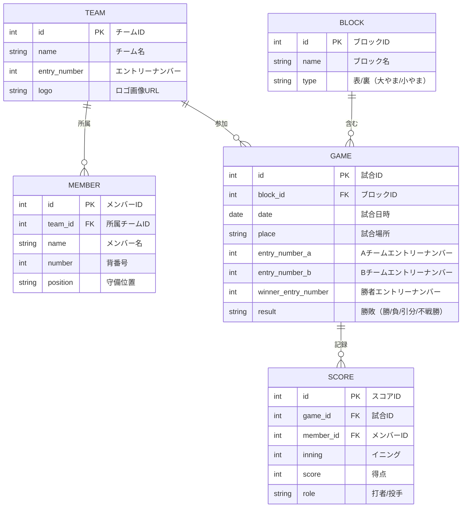

<link rel="stylesheet" href="markdown-style.css">

# 野球大会管理システム

## 目次 <!-- omit in toc -->

1. [1. 要件定義書](#1-要件定義書)
	1. [1.1. はじめに](#11-はじめに)
		1. [1.1.1. 文書の目的](#111-文書の目的)
		2. [1.1.2. 背景・目的](#112-背景目的)
		3. [1.1.3. 適用範囲](#113-適用範囲)
		4. [1.1.4. 関係者一覧](#114-関係者一覧)
2. [2. 用語定義](#2-用語定義)
3. [3. 現状課題](#3-現状課題)
4. [4. システム化の目的](#4-システム化の目的)
5. [5. 業務フロー・業務要件](#5-業務フロー業務要件)
	1. [5.1. 業務プロセス概要](#51-業務プロセス概要)
	2. [5.2. 業務フロー図](#52-業務フロー図)
6. [6. システム概要](#6-システム概要)
	1. [6.1. システム全体像](#61-システム全体像)
	2. [6.2. システム構成図](#62-システム構成図)
7. [7. 利用者区分・権限一覧](#7-利用者区分権限一覧)
8. [8. 機能要件](#8-機能要件)
	1. [8.1. 機能一覧](#81-機能一覧)
	2. [8.2. 各機能の詳細要件](#82-各機能の詳細要件)
		1. [8.2.1. ログイン管理](#821-ログイン管理)
		2. [8.2.2. チーム管理](#822-チーム管理)
		3. [8.2.3. 試合管理](#823-試合管理)
		4. [8.2.4. スコア管理](#824-スコア管理)
		5. [8.2.5. 管理機能](#825-管理機能)
9. [9. 非機能要件](#9-非機能要件)
	1. [9.1. セキュリティ](#91-セキュリティ)
	2. [9.2. パフォーマンス](#92-パフォーマンス)
	3. [9.3. 可用性](#93-可用性)
	4. [9.4. 保守性](#94-保守性)
	5. [9.5. 拡張性](#95-拡張性)
	6. [9.6. ユーザビリティ](#96-ユーザビリティ)
	7. [9.7. バックアップ・リカバリ](#97-バックアップリカバリ)
	8. [9.8. ログ・監査](#98-ログ監査)
	9. [9.9. エラーハンドリング](#99-エラーハンドリング)
	10. [9.10. テスト要件](#910-テスト要件)
10. [10. データ要件](#10-データ要件)
	 1. [10.1. データ項目定義](#101-データ項目定義)
	 2. [10.2. データ構造](#102-データ構造)
11. [11. 外部インターフェース要件](#11-外部インターフェース要件)
	 1. [11.1. 他システム連携](#111-他システム連携)
	 2. [11.2. 入出力ファイル仕様](#112-入出力ファイル仕様)
	 3. [11.3. API仕様](#113-api仕様)
12. [12. 運用・保守要件](#12-運用保守要件)
	 1. [12.1. 運用体制](#121-運用体制)
	 2. [12.2. 保守体制](#122-保守体制)
	 3. [12.3. 障害対応](#123-障害対応)
13. [13. 画面・帳票要件](#13-画面帳票要件)
	 1. [13.1. 画面一覧](#131-画面一覧)
	 2. [13.2. 帳票一覧](#132-帳票一覧)
14. [14. テスト要件](#14-テスト要件)
	 1. [14.1. テスト方針](#141-テスト方針)
	 2. [14.2. テスト項目例](#142-テスト項目例)
15. [15. 移行要件](#15-移行要件)
	 1. [15.1. データ移行](#151-データ移行)
	 2. [15.2. 移行手順](#152-移行手順)
16. [16. スケジュール・マイルストーン](#16-スケジュールマイルストーン)
17. [17. コスト・予算](#17-コスト予算)
18. [18. リスク・課題管理](#18-リスク課題管理)
19. [19. 変更履歴](#19-変更履歴)
20. [20. 特記事項・課題](#20-特記事項課題)
	 1. [⚾ 少年野球サイトの主要な要件（まとめ）](#-少年野球サイトの主要な要件まとめ)
		 1. [1. サイトの目標とスケジュール](#1-サイトの目標とスケジュール)
		 2. [2. 機能要件](#2-機能要件)
		 3. [3. 検討・解決が必要な課題](#3-検討解決が必要な課題)
		 4. [4. その他（付随的な要望）](#4-その他付随的な要望)
21. [📝 要件定義書（概要）](#-要件定義書概要)
	 1. [2. システム概要](#2-システム概要)
	 2. [3. 機能要件](#3-機能要件)
		 1. [3.1 ユーザー管理](#31-ユーザー管理)
		 2. [3.2 組み合わせ管理](#32-組み合わせ管理)
		 3. [3.3 試合入力機能](#33-試合入力機能)
		 4. [3.4 トーナメント表表示](#34-トーナメント表表示)
		 5. [3.5 結果管理](#35-結果管理)
	 3. [4. 非機能要件](#4-非機能要件)
	 4. [5. 今後の課題・検討事項](#5-今後の課題検討事項)
	 5. [2025.10.21](#20251021)
	 6. [2025.11.11](#20251111)

## 1. 要件定義書
### 1.1. はじめに
本書は、滋賀県学童野球大会の組み合わせ表・勝敗表サイト構築に関する要件定義書である。システム開発に必要な機能・非機能要件を明確化し、関係者間の認識を統一することを目的とする。

#### 1.1.1. 文書の目的
- 本システムの開発範囲・目的を明確化する。

#### 1.1.2. 背景・目的

- 滋賀県小学生野球交流連盟の大会運営を効率化するため、試合の組み合わせ・結果入力・トーナメント進行をWeb上で管理できるシステムを構築する。
- 責任者が簡単に操作できること、視覚的に勝敗が分かることが求められている。

#### 1.1.3. 適用範囲
- 滋賀県学童野球大会の運営・管理に関するWebシステム。
#### 1.1.4. 関係者一覧
- 本部（運営管理者）、各チーム監督、一般ユーザー
##  2. 用語定義
|用語|意味|
|:--|:--|
|本部|大会運営管理者|
|監督|各チームの責任者|
|裏トーナメント|敗者復活戦。「大やま」「小やま」区分あり|
|エントリーナンバー|チームごとに付与される番号|
|抽選番号|試合ごとに付与される番号|
|大やま|裏トーナメントの上位ブロック|
|小やま|裏トーナメントの下位ブロック|

## 3. 現状課題
- 情報共有・更新に時間がかかる
- 誤入力や記録漏れが発生しやすい
- 一般ユーザーへの情報公開が遅れる
- 更新遅延平均2日→Web化で即時反映
## 4. システム化の目的
- 組み合わせ表・勝敗表のWeb化による運営効率化
- 監督による試合結果の直接入力
- 一般ユーザーへの情報公開
- システム導入による定量的な効果
-   
##  5. 業務フロー・業務要件
- 本部が大会情報・組み合わせ表を登録
- 監督が試合日時・スコアを入力
- 1回戦敗退チームは自動で裏トーナメントへ転記
- 準々決勝以降は本部管理
### 5.1. 業務プロセス概要
- 本部：大会全体管理、ユーザー管理
- 監督：自チームの試合・スコア入力
- 一般ユーザー：閲覧のみ
### 5.2. 業務フロー図
- 監督が試合結果を入力→自動でトーナメント表更新
##  6. システム概要
本システムは、ログイン管理、チーム管理、試合管理、スコア管理、トーナメント表自動更新機能を備えるWebアプリケーションである。

- ログイン・権限管理（本部・監督・一般ユーザー）
- チーム情報管理（メンバー、背番号、守備位置）
- 試合スケジュール管理（日時・場所・対戦相手・参加メンバー）
- スコア・成績入力（勝敗・引き分け・不戦勝対応）
- トーナメント表・敗者復活戦表の自動更新・強調表示
### 6.1. システム全体像
- レンタルサーバ利用
- 推奨ブラウザはChrome最新版
### 6.2. システム構成図
##  7. 利用者区分・権限一覧
|利用者| 権限|
|:--|:--|
|本部|全データ管理・ユーザー管理|
|監督| 自チームの試合・スコア入力|
|一般|組み合わせ表・勝敗表閲覧のみ|

##  8. 機能要件

### 8.1. 機能一覧
- ログイン管理
- チーム管理
- 試合管理
- スコア管理
- 管理機能（バックアップ・リストア・CSV入出力）
### 8.2. 各機能の詳細要件
#### 8.2.1. ログイン管理
- ユーザーID・PW認証。5回連続失敗でロック
- セッション有効期限3時間。期限切れで自動ログアウト
#### 8.2.2. チーム管理

- チーム一覧（チーム名・勝率表示）
- チーム登録・修正・削除（本部のみ登録/削除、監督は修正可）
- メンバー登録（名前・背番号・守備位置）

#### 8.2.3. 試合管理

- 年度・大会・ブロック・参加チーム登録
- エントリーナンバー・抽選番号（試合番号）付与
- 組み合わせ表インポート
- 試合日程・場所登録
- 参加メンバー・ポジション・打順・バッテリー登録
- 試合日程カレンダー表示

#### 8.2.4. スコア管理

- 試合スコア入力（A・B両チームどちらでも可）
- 引き分け/不戦勝時は抽選勝敗入力、スコアは表に残す
- 第1試合敗退チームは裏トーナメントへ自動転記
- 打者・投手スコア入力（イニングごと）
- 個人成績ランキング表示

#### 8.2.5. 管理機能

- DBバックアップ・リストア
- CSVインポート/エクスポート
- 操作ログ管理機能

##  9. 非機能要件

### 9.1. セキュリティ

- パスワードは暗号化する
- SQLインジェクション対策（プリペアドステートメント）
- XSS対策（出力エスケープ）
- ログイン時セッション再生成

### 9.2. パフォーマンス

- 同時アクセス10ユーザー想定
- ページ応答1秒以内（ローカル環境）
### 9.3. 可用性
- 稼働率99%以上を目標
### 9.4. 保守性

- 拡張しやすい構成とする
- コード・ドキュメントの標準化

### 9.5. 拡張性
- 将来的なAPI連携を考慮した設計
### 9.6. ユーザビリティ

- スマホ/PC両対応（レスポンシブ）
- 入力バリデーション
- ナビゲーションメニュー

### 9.7. バックアップ・リカバリ
- バックアップ頻度：1日1回0時
- 保存期間：7日間
### 9.8. ログ・監査
- 監査ログの保存期間：7日
- 閲覧権限：管理者
### 9.9. エラーハンドリング

- 例外時ログ出力
- ユーザー向けエラーメッセージ（内部情報非表示）

### 9.10. テスト要件

- 単体、結合、受入テストを実施すること
- 自動テストの導入

##  10. データ要件

### 10.1. データ項目定義
|データ項目|型|必須|備考|
|:--|:--|:--:|:--|
|チーム名|文字列|○|一意||
|エントリーナンバー|数値|○||
|メンバー名|文字列|○||
|背番号|数値|○||
|守備位置|文字列|○||
|試合番号|数値|○||
|試合日時|日付|○||
|試合場所|文字列|○||
|スコア|数値|○|イニングごと|
### 10.2. データ構造

- TEAM（チーム）とMEMBER（メンバー）は1対多
- TEAMとGAME（試合）は多対多（実装上はA/Bエントリーナンバーで管理）
- GAMEとSCORE（スコア）は1対多
- BLOCK（ブロック）は複数の試合を含む
- 「裏トーナメント」「大やま」「小やま」はBLOCKのtypeで管理

##  11. 外部インターフェース要件
### 11.1. 他システム連携
- 外部システムとの連携は現時点なし
### 11.2. 入出力ファイル仕様
- CSVインポート/エクスポート機能（フォーマット例は別途資料）
### 11.3. API仕様
- API設計方針の明記
##  12. 運用・保守要件
### 12.1. 運用体制
- 本部がシステム運用・保守を担当
### 12.2. 保守体制
- 障害時の対応フロー・連絡先一覧
### 12.3. 障害対応
- 障害発生時は即時対応、バックアップからリストア可能
- 障害時はsupport@example.comへ連絡
##  13. 画面・帳票要件

### 13.1. 画面一覧
- 共通画面（案）
 
  

  > - メニュー構成など、全体のイメージが合っているか確認。

- お知らせ（案）

  

  > - お知らせを単体で別ページにした方がいいか、他のページと組み合わせて表示した方がいいか確認。

- 大会概要（案）

  

  > - 大会の概要を単体ページにした方がいいか、他のページと組み合わせて表示した方がいいか確認。
  > - 大会概要に記載する内容の入手。

- 試合結果（案）

  

  > - 試合結果を単体で別ページにした方がいいか、他のページと組み合わせて表示した方がいいか確認。
  > - 最大参加チーム数は70チーム35試合でいいか確認。
  > - 表トーナメントと裏トーナメントの表示方法はどうしたらいいか確認。
  > - 各試合のイニング毎の得点表などは必要か確認。

- 大会規定（案）

  

  > - 大会の規約を単体ページにした方がいいか、他のページと組み合わせて表示した方がいいか確認。
  > - 大会規約に記載する内容の入手。
  
- 監督メニュー
  
  

  > - 大会を検索／選択する。
  > - 選択された大会の自チームに関する試合の一覧から、自チーム／相手チームの得点を入力し、更新する。
  > - 同点の場合等、勝ち負けを決定できるようにする。

- 本部メニュー
  
  

  > - 本部専用のメニューを表示。

- 大会登録
  
  

  > - 大会名／開始日／終了日の登録・更新・削除を行う

- チーム登録
  
  

  > - チーム名／監督IDの登録・更新・削除を行う。
  > - 監督IDはランダムな6桁の番号を自動採番し、監督が試合結果を更新する際に使用。

- 試合登録
  
  

  > - 対戦するチームを登録・更新・削除を行う。

- ログイン
  
  

  > - ログインIDとパスワードにてログインする。

### 13.2. 帳票一覧
- なし

## 14. テスト要件

### 14.1. テスト方針
- 単体・結合・受入テストを実施
### 14.2. テスト項目例
- ログイン認証
- スコア入力
- CSVインポート/エクスポート
- レスポンシブ表示テスト
- セキュリティテスト
## 15. 移行要件
### 15.1. データ移行
- 既存ExcelデータをCSV形式でインポート
### 15.2. 移行手順
- 移行後、データ整合性を確認
- 移行時のバックアップ取得
## 16. スケジュール・マイルストーン
|工程|期間|
|:--|:--|
|要件定義|2025年10月|
|開発|2025年11月～2026年2月|
|テスト|2026年3月|
|リリース|2026年4月|
## 17. コスト・予算
|項目|概算費用|備考|
|:--|--:|:--
|開発費用|○○万円||
|保守費用|○○万円|/年|
## 18. リスク・課題管理
- トーナメント表ロジック未確定→サンプル到着後に設計
- 「大やま」「小やま」区分の詳細は後日説明
- システム障害時のリスク
- データ消失リスク
## 19. 変更履歴

|日付| 変更内容| 変更者|
|:--|:--|:--|
|2025/10/26| 初版作成| ○○|
|2025/11/10| 機能要件追記|○○|

## 20. 特記事項・課題

- トーナメント表の現物サンプル到着後、詳細設計を追記
- 「大やま」「小やま」区分による裏トーナメント転記ロジックは後日口頭説明
- 引き分け・不戦勝時の運用ルール（抽選方法・記録方法）は運用ルールを明確化すること
- 運用マニュアル作成
- FAQの整備

ご提供いただいたメールの内容に基づき、少年野球サイトの作成にあたり提示されている**主な要件**をまとめます。

このサイトの目的は、**滋賀県小学生野球交流連盟**の大会運営をサポートし、特に試合結果の管理と情報公開を効率化することです。

---

### ⚾ 少年野球サイトの主要な要件（まとめ）

#### 1. サイトの目標とスケジュール
* **完成目標**: 2026年4月〜5月上旬。
* **承認・運用開始**: 5月下旬の総会で承認後、7月〜運用開始予定。
* **目的**: 2026年に向けた学童野球の組み合わせ表、勝敗表のサイトを実現する。

#### 2. 機能要件
* **試合結果の入力・公開**:
    * 少年野球の**各チームの責任者（監督）がログイン（PW使用）して試合結果を入力**する仕組みが必要。
    * 入力された結果は、即座にHPなどにアップされること。
    * **入力担当**: Aチーム、Bチームのどちらが入れてもOKとし、運用ルールで決める。
    * **「自主対戦制」での利用**: 1回戦〜3回戦頃の試合数の多い期間（自主対戦制）で、**試合の日時**と**点数**の入力をサイト上で行えるようにする。
    * **本部管理試合**: 準々決勝〜決勝は本部側が管理するため、チームはサイトへアクセスできなくてよい（ログイン制限）。
* **トーナメント表（表・裏）**:
    * 本部（HPL）側でインプットした組み合わせ表からスタート。
    * 入力された時点で、**トーナメント表の勝ち上がりが視覚的にわかる**ようにする（ラインを太字や色字にするなど）。
    * **敗者復活戦（裏トーナメント）への自動振り分け**: 1回戦で負けたチームは、自動的に裏トーナメントの組み合わせ表にチーム名がセットされること。
        * 裏トーナメントの転記先は、トーナメント表の「大やま」「小やま」によって決まるため注意が必要（口頭説明が必要な複雑な部分）。

#### 3. 検討・解決が必要な課題
* **スコア入力の整合性**: AチームとBチームのスコア入力が一方のチームに限定されないようにする方法（例: 両チーム入力OKとするが、両方でスコアが食い違った場合をどうするか、など）。
* **引き分け・不戦勝の対応**:
    * 引き分けの場合、勝敗は抽選などで決まるが、**試合結果（例: 5対5）はトーナメント表に残したい**ため、その場合の表記方法を検討する必要がある。

#### 4. その他（付随的な要望）
* **サイトの収益化**: HP上に**協賛企業のバナー**を貼ったり、**商品販売**ができる機能（ECサイトのようなもの）を実装できればベスト。
* **運用環境**: サーバー契約やGoogle Workspace/365等のクラウド環境がないため、できるだけ**ローコスト**で実現できるアイデアを求めている。

---

## 📝 要件定義書（概要）

### 2. システム概要

*   **対象ユーザー**：大会本部（HPL）、各チームの監督（責任者）
*   **利用目的**：
    *   組み合わせ表の作成・管理
    *   試合日時・結果の入力
    *   トーナメント表の自動更新
    *   裏トーナメント（敗者復活戦）の自動生成
    *   全国大会出場チームの判定

### 3. 機能要件

#### 3.1 ユーザー管理

*   各チームにエントリー番号を付与
*   各監督にログイン用パスワードを発行（大会ごとに共通でも可）
*   試合進行に応じてログイン制限（準々決勝以降は本部のみ入力可）

#### 3.2 組み合わせ管理

*   本部が初期組み合わせ表をインプット
*   1回戦の抽選機能（試合番号の自動付与）

#### 3.3 試合入力機能

*   各監督が試合日時・結果を入力
*   自主対戦制（1〜3回戦）：監督同士で連絡を取り合い、日時・場所を決定
*   試合結果（スコア）入力
*   引き分け・不戦勝の表記対応（例：5対5の引き分け → 勝敗は抽選）

#### 3.4 トーナメント表表示

*   勝ち上がりチームのラインを太字・色字で視覚的に表示
*   裏トーナメントへの自動転記（敗者復活戦）
    *   表トーナメントの「大やま」「小やま」に応じて転記先を制御

#### 3.5 結果管理

*   全国大会出場権の判定（表・裏それぞれの優勝・準優勝）

### 4. 非機能要件

*   **操作性**：Web知識がないユーザーでも直感的に操作可能
*   **コスト**：ローコストでの実現（kintoneなどの活用も検討）
*   **セキュリティ**：簡易ログイン機能、試合進行に応じたアクセス制限

### 5. 今後の課題・検討事項

*   引き分け時の表記ルールの詳細
*   裏トーナメントの転記ロジック（口頭説明予定）
*   EC機能（協賛企業バナー、商品販売）との連携可能性
*   Excelベースの販売管理との統合案

### 2025.10.21

・以前つくってもらった物販の受注管理用エクセルは、一旦そのままでオッケーです。
・2026年に向けて学童野球の組み合わせ表、勝敗表のサイトの方を実現していきたい。

・サイトの参考イメージは下記URLのような感じ
https://pridejapan.net/pjtoyama/
https://pridejapan.net/pjtoyama/?oytype=T
https://shiga.pop.co.jp/tg/popcup/index.php?popcup_no=18

・滋賀の大会用なのでエントリーチームは決まっており、本部（HPL）側でインプットした組み合わせ表からスタートでOK（※）
・エントリーしたたとえば70チームに、まずはエントリーチーム№をつける
・35の第一試合を抽選で決める。➡抽選№（試合№）をつける
・各チームの監督（責任者）にはPWを渡してサイトへインプットできるようにする（大会ごとに全員同じPWでもOK）
・A・B両チームのどちらが入れてもOKで、どちらが入れるかは運用ルールで決める（先の質問の件）

【課題というかややこしい部分】

🔳入力された時点でトーナメント表のラインが太字？色字？などで勝ち上がりが視覚的にわかるようにしたい（次の試合はどこがあたるかわかるように）

🔳1回戦で負けたチームは、自動的に裏トーナメントの組み合わせ表の方にチーム名がセットされるようにしたい
（裏トーナメントは敗者復活トーナメントで、こちらはこちらで優勝/準優勝チームには全国大会に出られる権利がもらえるそうです）
（全国大会にもいろいろレベルがあって、表トーナメントの勝者が出る全国大会と、裏トーナメントの勝者が出る全国大会があるようです。）
（トーナメント表の”大やま” ”小やま”によっても裏トーナメント表の転記先が決まっているので注意★これは文書で伝えるのは難しいので後日口頭説明します）

🔳準々決勝～決勝になってくると、球場も本部側が確保し、試合も数試合になってくるため、チームはサイトへアクセスできなくてもいい（ＰＷでログインできないようにするなど）

🔳それまでの1回戦～3回戦ぐらいまでを「自主対戦制」と呼び、組み合わせの決まった2チームの監督が連絡をとって、日時と試合場所を決める。この間の試合数が非常に多く、現在はラインやメールでやりとりしてやっている。サイトへ直接入力させたいのはこの部分。上記（※）の組み合わせ表ができたらまず「試合の日時」のみを各チームの監督が入力、試合が終わったら点数を入力する。

🔳問題は引き分けや不戦勝の場合。引き分けの場合は抽選（じゃんけん？）で勝敗は決まるが、試合そのものは例えば５対５だったことはトーナメント表に残したいので、その場合の表記方法を考える必要がある。

以上です。
トーナメント表の現物サンプルは手元にあるのですが、データで送信してもらえるように依頼しています。
それを見ながらあらためて説明します！！

### 2025.11.11
🔳メニュー構成の内容は概ねオッケーです。
全体のイメージとしては、昨日のLINEのとおり下記のふたつのサイトを合体させたようなものです。
ほとんどのチーム責任者は今時なのでスマホからの操作になると思います。

https://nasu.kickoff-baseball.com/
https://pridejapan.net/pjtoyama/?oytype=S

🔳お知らせは単体でいいと思いますが、お知らせ項目から大会詳細へリンクしたい。

🔳大会概要の項目は、最低限の項目にしておいて、大会要項を細かく追記できるようにしたい
現在は説明図などを入れた案内になっていて20項目ぐらいの説明になっている。

たとえば、申込期日いついつまで、協賛条件がどう、審判はどう、とか。
大会ごとにエクセル等で作成しているものをそのままアップできるようにした方が使いやすいかもしれない
★いくつかサンプルをもらったので添付しておきます。

🔳試合結果のページは単体でいいと思います。（が、下記の監督メニュー（チーム責任者メニュー）が単体になるなら重複するので要検討）
チーム数は増減の可能性あるが、現時点では64チーム32試合がMAX。
※だいたい、それ以下のチーム数、試合数の大会になります。

表トーナメントと裏トーナメントは同じページで、負けたチームは裏トーナメント表の所定位置に自動転記されるしくみがいい
イニング毎の得点表は不要です。

🔳大会規約も要項も上記大会概要と同様にPDF等のできものを張り付けるイメージでいいと思う。

★そうなってくると、概要、規約、など単体ページではなく、大会ごとに見られるページにした方が見やすいのではないか。
★その場合大会ごとのページが増えてきた場合に、過去のものをどの程度残せるのか、も知りたい。

🔳監督メニュー（チーム責任者メニュー）のイメージは
試合場所の事前入力、試合結果の入力ですか？
大会ごとの共通ログインPWを変えるような運用ですか？

🔳本部メニューのイメージは
HPL側がさわる管理メニューですか？

🔳ログインは、
そのサイトそのものを見るためだとしたら、サイトにはガードをかける必要はありません。
逆にスポンサーのPR場所になるようなものができたらと思います。

🔳このサイトを運用する段階になったら、ランニングコストはどれくらいのイメージでしょうか。
