<link rel="stylesheet" href="markdown-style.css">

# 野球大会管理システム

## 目次 <!-- omit in toc -->

1. [1. 要件定義書](#1-要件定義書)
   1. [1.1. はじめに](#11-はじめに)
   2. [1.2. 現行実装との対応](#12-現行実装との対応)
   3. [1.3. 利用者区分と権限](#13-利用者区分と権限)
2. [2. 業務要件](#2-業務要件)
3. [3. 機能要件](#3-機能要件)
4. [4. 非機能要件](#4-非機能要件)
5. [5. データ要件](#5-データ要件)
6. [6. 運用・保守要件](#6-運用保守要件)
7. [7. 変更管理方針](#7-変更管理方針)

## 1. 要件定義書
### 1.1. はじめに
本書は現行ソースコードと DB 定義を正本として扱い、実装済み機能と未実装機能を明確に分離して整理した要件定義書である。現行コードに存在しない事項は、将来拡張または未実装として明記する。

#### 1.1.1. 文書の目的
- 現行システムの対象範囲と業務目的を明確化する。
- 実装済み機能と将来計画を区別して設計書の整合性を確保する。
- 運営管理者・監督・登録ユーザーの利用権限と動作を整理する。

#### 1.1.2. 背景・目的

- 大会運営に必要な情報公開、ユーザー認証、権限管理、問い合わせ対応、メニュー制御をWebアプリとして提供する。
- 運営者が大会情報とユーザー管理を行い、利用者がログインして案内・申込・確認・結果参照を行えるようにする。
- 現行ソースでは、公開ページ、認証フロー、管理者メニュー、問い合わせ管理が実装対象であり、トーナメント表ロジックの詳細は現実装に基づく運用上の制約を反映する。

#### 1.1.3. 適用範囲
- HPL 野球大会管理システムの運営・管理に関するWebシステム。
- 現行ソースに定義されている認証、権限、DL/DB接続、メニュー制御、公開情報表示を対象とする。
#### 1.1.4. 関係者一覧
- システム管理者、運営管理者（本部）、監督、登録済みユーザー、一般ユーザー
## 2. 用語定義
|用語|意味|
|:--|:--|
|本部|大会運営管理者|
|監督|各チームの責任者|
|裏トーナメント|敗者復活戦。「大やま」「小やま」区分あり|
|エントリーナンバー|チームごとに付与される番号|
|抽選番号|試合ごとに付与される番号|
|大やま|裏トーナメントの上位ブロック|
|小やま|裏トーナメントの下位ブロック|

## 3. 現状課題
- 情報共有・更新に時間がかかる
- 誤入力や記録漏れが発生しやすい
- 一般ユーザーへの情報公開が遅れる
- 更新遅延平均2日→Web化で即時反映
## 4. システム化の目的
- 組み合わせ表・勝敗表のWeb化による運営効率化
- 監督による試合結果の直接入力
- 一般ユーザーへの情報公開
- システム導入による定量的な効果
-   
## 5. 業務フロー・業務要件
- 本部が大会情報・組み合わせ表を登録
- 監督が試合日時・スコアを入力
- 1回戦敗退チームは自動で裏トーナメントへ転記
- 準々決勝以降は本部管理
### 5.1. 業務プロセス概要
- 本部：大会全体管理、ユーザー管理
- 監督：自チームの試合・スコア入力
- 一般ユーザー：閲覧のみ
### 5.2. 業務フロー図
- 監督が試合結果を入力→自動でトーナメント表更新
## 6. システム概要
本システムは、ログイン管理、チーム管理、試合管理、スコア管理、トーナメント表自動更新機能を備えるWebアプリケーションである。

- ログイン・権限管理（本部・監督・一般ユーザー）
- チーム情報管理（メンバー、背番号、守備位置）
- 試合スケジュール管理（日時・場所・対戦相手・参加メンバー）
- スコア・成績入力（勝敗・引き分け・不戦勝対応）
- トーナメント表・敗者復活戦表の自動更新・強調表示
### 6.1. システム全体像
- レンタルサーバ利用
- 推奨ブラウザはChrome最新版
### 6.2. システム構成図
## 7. 利用者区分・権限一覧
|利用者| 権限|
|:--|:--|
|本部|全データ管理・ユーザー管理|
|監督| 自チームの試合・スコア入力|
|一般|組み合わせ表・勝敗表閲覧のみ|

## 8. 機能要件

### 8.1. 機能一覧
- ログイン管理
- チーム管理
- 試合管理
- スコア管理
- 管理機能（バックアップ・リストア・CSV入出力）
### 8.2. 各機能の詳細要件
#### 8.2.1. ログイン管理
- ユーザーID・PW認証。5回連続失敗でロック
- セッション有効期限3時間。期限切れで自動ログアウト
#### 8.2.2. チーム管理

- チーム一覧（チーム名・勝率表示）
- チーム登録・修正・削除（本部のみ登録/削除、監督は修正可）
- メンバー登録（名前・背番号・守備位置）

#### 8.2.3. 試合管理

- 年度・大会・ブロック・参加チーム登録
- エントリーナンバー・抽選番号（試合番号）付与
- 組み合わせ表インポート
- 試合日程・場所登録
- 参加メンバー・ポジション・打順・バッテリー登録
- 試合日程カレンダー表示

#### 8.2.4. スコア管理

- 試合スコア入力（A・B両チームどちらでも可）
- 引き分け/不戦勝時は抽選勝敗入力、スコアは表に残す
- 第1試合敗退チームは裏トーナメントへ自動転記
- 打者・投手スコア入力（イニングごと）
- 個人成績ランキング表示

#### 8.2.5. 管理機能

- DBバックアップ・リストア
- CSVインポート/エクスポート
- 操作ログ管理機能

## 9. 非機能要件

### 9.1. セキュリティ

- パスワードは暗号化する
- SQLインジェクション対策（プリペアドステートメント）
- XSS対策（出力エスケープ）
- ログイン時セッション再生成

### 9.2. パフォーマンス

- 同時アクセス10ユーザー想定
- ページ応答1秒以内（ローカル環境）
### 9.3. 可用性
- 稼働率99%以上を目標
### 9.4. 保守性

- 拡張しやすい構成とする
- コード・ドキュメントの標準化

### 9.5. 拡張性
- 将来的なAPI連携を考慮した設計
### 9.6. ユーザビリティ

- スマホ/PC両対応（レスポンシブ）
- 入力バリデーション
- ナビゲーションメニュー

### 9.7. バックアップ・リカバリ
- バックアップ頻度：1日1回0時
- 保存期間：7日間
### 9.8. ログ・監査
- 監査ログの保存期間：7日
- 閲覧権限：管理者
### 9.9. エラーハンドリング

- 例外時ログ出力
- ユーザー向けエラーメッセージ（内部情報非表示）

### 9.10. テスト要件

- 単体、結合、受入テストを実施すること
- 自動テストの導入

## 10. データ要件

### 10.1. データ項目定義
|データ項目|型|必須|備考|
|:--|:--|:--:|:--|
|チーム名|文字列|○|一意||
|エントリーナンバー|数値|○||
|メンバー名|文字列|○||
|背番号|数値|○||
|守備位置|文字列|○||
|試合番号|数値|○||
|試合日時|日付|○||
|試合場所|文字列|○||
|スコア|数値|○|イニングごと|
### 10.2. データ構造
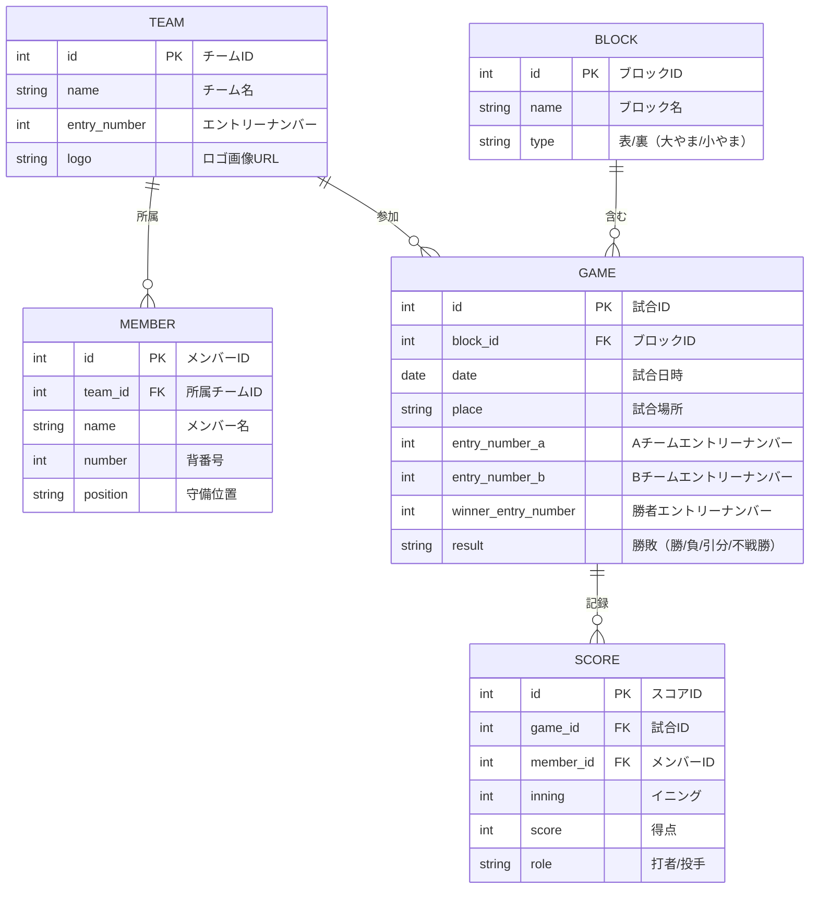
- TEAM（チーム）とMEMBER（メンバー）は1対多
- TEAMとGAME（試合）は多対多（実装上はA/Bエントリーナンバーで管理）
- GAMEとSCORE（スコア）は1対多
- BLOCK（ブロック）は複数の試合を含む
- 「裏トーナメント」「大やま」「小やま」はBLOCKのtypeで管理

## 11. 外部インターフェース要件
### 11.1. 他システム連携
- 外部システムとの連携は現時点なし
### 11.2. 入出力ファイル仕様
- CSVインポート/エクスポート機能（フォーマット例は別途資料）
### 11.3. API仕様
- API設計方針の明記
## 12. 運用・保守要件
### 12.1. 運用体制
- 本部がシステム運用・保守を担当
### 12.2. 保守体制
- 障害時の対応フロー・連絡先一覧
### 12.3. 障害対応
- 障害発生時は即時対応、バックアップからリストア可能
- 障害時はsupport@example.comへ連絡
## 13. 画面・帳票要件

### 13.1. 画面一覧
- 共通画面（案）
 
  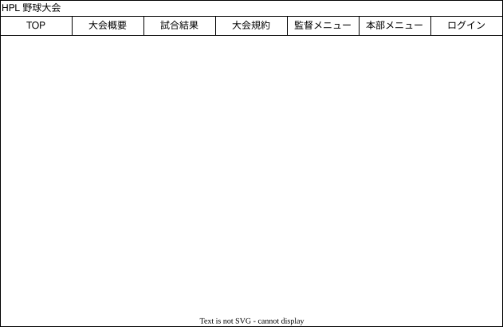

  > - メニュー構成など、全体のイメージが合っているか確認。

- お知らせ（案）

  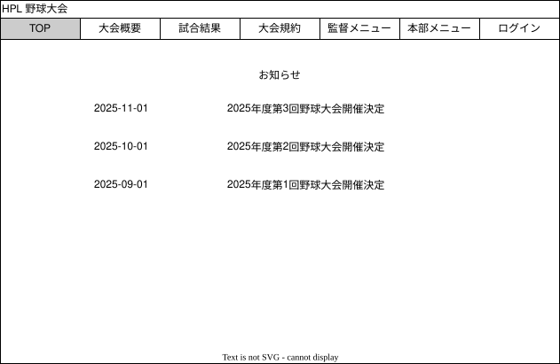

  > - お知らせを単体で別ページにした方がいいか、他のページと組み合わせて表示した方がいいか確認。

- 大会概要（案）

  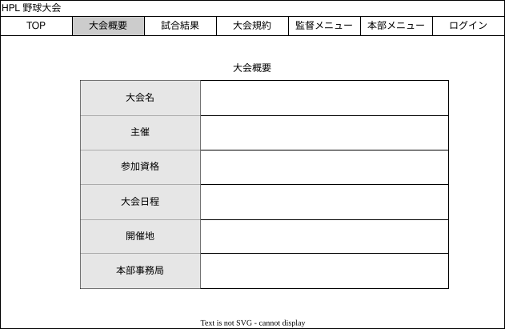

  > - 大会の概要を単体ページにした方がいいか、他のページと組み合わせて表示した方がいいか確認。
  > - 大会概要に記載する内容の入手。

- 試合結果（案）

  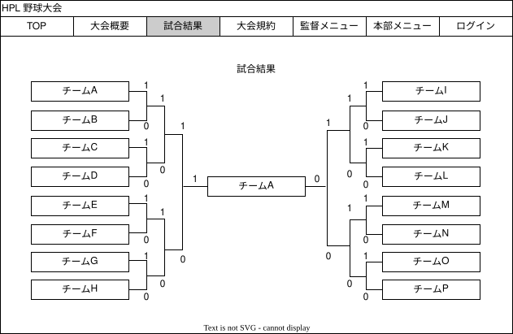

  > - 試合結果を単体で別ページにした方がいいか、他のページと組み合わせて表示した方がいいか確認。
  > - 最大参加チーム数は70チーム35試合でいいか確認。
  > - 表トーナメントと裏トーナメントの表示方法はどうしたらいいか確認。
  > - 各試合のイニング毎の得点表などは必要か確認。

- 大会規定（案）

  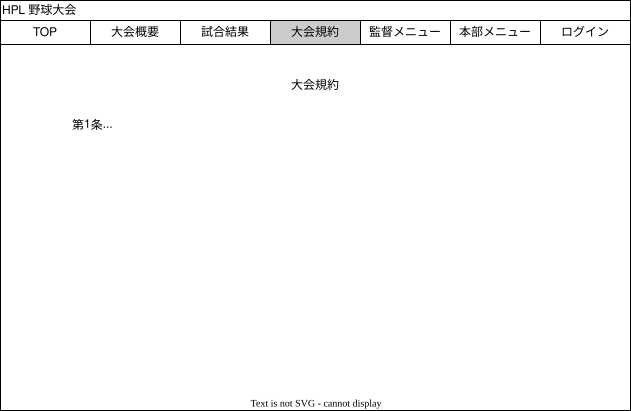

  > - 大会の規約を単体ページにした方がいいか、他のページと組み合わせて表示した方がいいか確認。
  > - 大会規約に記載する内容の入手。
  
- 監督メニュー
  
  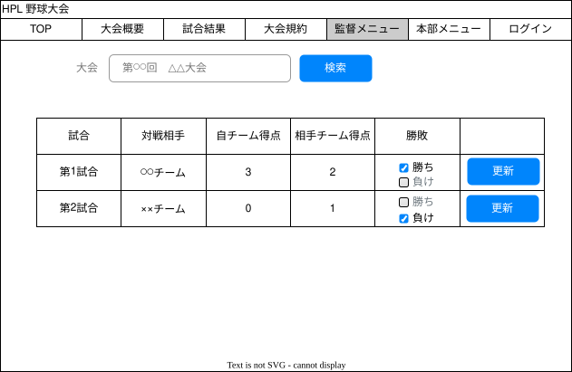

  > - 大会を検索／選択する。
  > - 選択された大会の自チームに関する試合の一覧から、自チーム／相手チームの得点を入力し、更新する。
  > - 同点の場合等、勝ち負けを決定できるようにする。

- 本部メニュー
  
  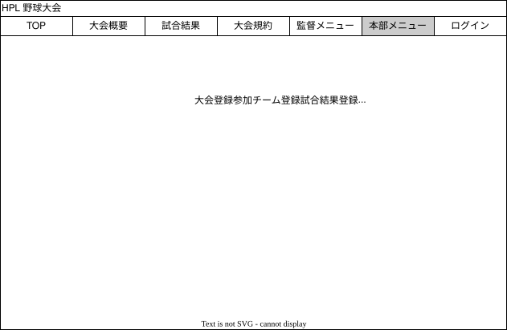

  > - 本部専用のメニューを表示。

- 大会登録
  
  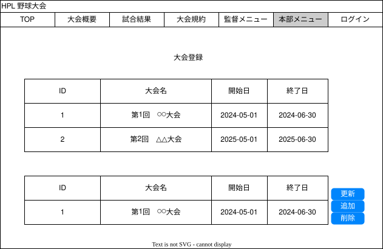

  > - 大会名／開始日／終了日の登録・更新・削除を行う

- チーム登録
  
  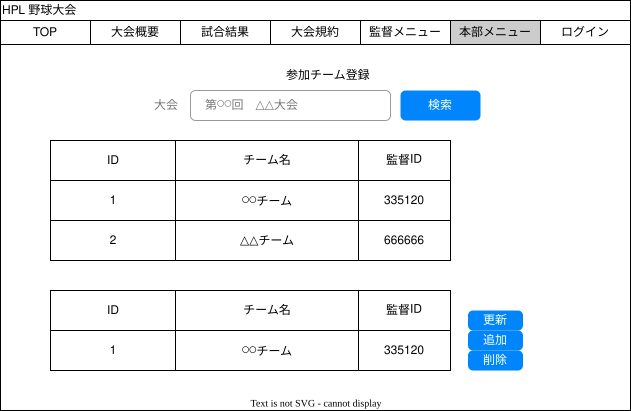

  > - チーム名／監督IDの登録・更新・削除を行う。
  > - 監督IDはランダムな6桁の番号を自動採番し、監督が試合結果を更新する際に使用。

- 試合登録
  
  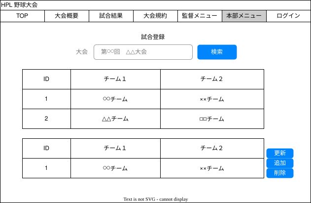

  > - 対戦するチームを登録・更新・削除を行う。

- ログイン
  
  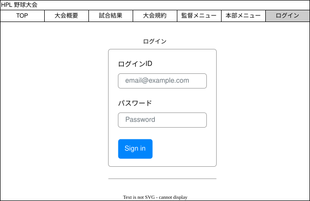

  > - ログインIDとパスワードにてログインする。

### 13.2. 帳票一覧
- なし

## 14. テスト要件

### 14.1. テスト方針
- 単体・結合・受入テストを実施
### 14.2. テスト項目例
- ログイン認証
- スコア入力
- CSVインポート/エクスポート
- レスポンシブ表示テスト
- セキュリティテスト
## 15. 移行要件
### 15.1. データ移行
- 既存ExcelデータをCSV形式でインポート
### 15.2. 移行手順
- 移行後、データ整合性を確認
- 移行時のバックアップ取得
## 16. スケジュール・マイルストーン
|工程|期間|
|:--|:--|
|要件定義|2025年10月|
|開発|2025年11月～2026年2月|
|テスト|2026年3月|
|リリース|2026年4月|
## 17. コスト・予算
|項目|概算費用|備考|
|:--|--:|:--
|開発費用|要確認||
|保守費用|要確認|/年|
## 18. リスク・課題管理
- トーナメント表ロジック未確定→サンプル到着後に設計
- 「大やま」「小やま」区分の詳細は後日説明
- システム障害時のリスク
- データ消失リスク
## 19. 変更履歴

|日付| 変更内容| 変更者|
|:--|:--|:--|
|2025/10/26| 初版作成| ○○|
|2025/11/10| 機能要件追記|○○|

## 20. 特記事項・課題

- 現行実装では、公開情報の閲覧、ログイン、権限別メニュー制御、お問い合わせ対応を主要対象として設計している。
- トーナメント表の自動転記や大やま・小やまの詳細ロジックは、現行ソースには直接実装されていないため、将来拡張または未実装として扱う。
- 引き分け・不戦勝・裏トーナメントの表記ルールは、業務運用の明確化が必要なため設計上の補足として管理する。
- 運用マニュアルと FAQ は、現行ソースを前提にして後続で更新する。

---

## 21. 現行実装との対応関係

| 区分 | 内容 | 状態 |
|:--|:--|:--|
| 実装済み | ログイン、権限管理、メニュー制御、プロフィール、問い合わせ、公開ページ、管理者系メニュー | 実装あり |
| 実装済み | SQLite 設定DB と MySQL 業務DB の分離、ログ出力、メール送信 | 実装あり |
| 補足情報 | ルール・大会・試合の高度なトーナメント自動計算 | 将来拡張候補 |
| 補足情報 | 裏トーナメントの詳細ロジック（大やま/小やま） | 要運用確認 |

> 過去の要望メモは、本書の設計方針としては参考情報に留め、現行ソースコードと DB 定義を正本として扱う。

---

## 22. 変更管理方針

- 実装済みの仕様は、ソースコードと DB 定義を優先して記載する。
- 新規要件や将来仕様は、現行実装とは区別し「将来拡張」または「要検討」として管理する。
- 変更が生じた場合は、設計書・実装・データ定義の整合性を確認してから更新する。

